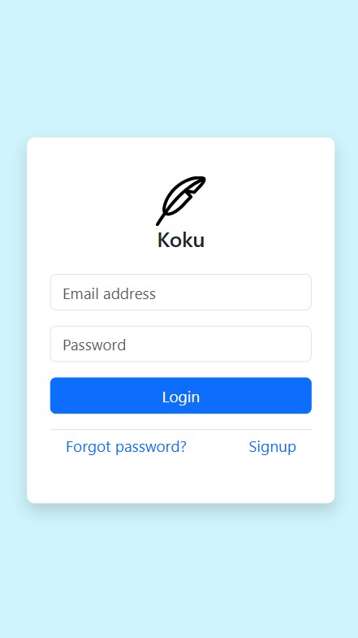
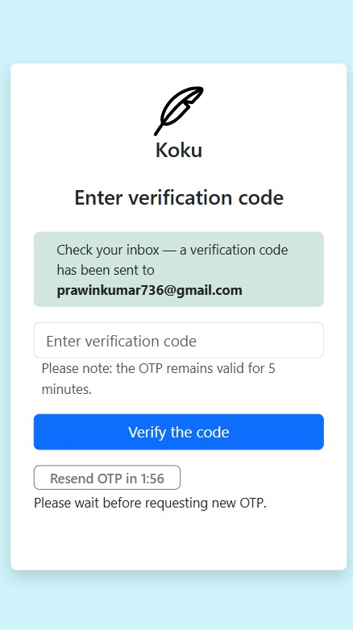
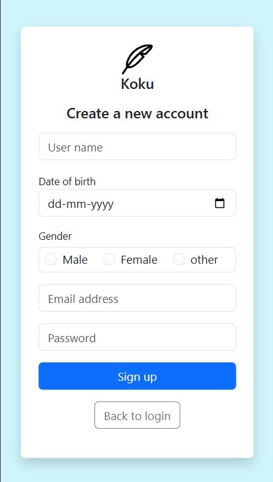
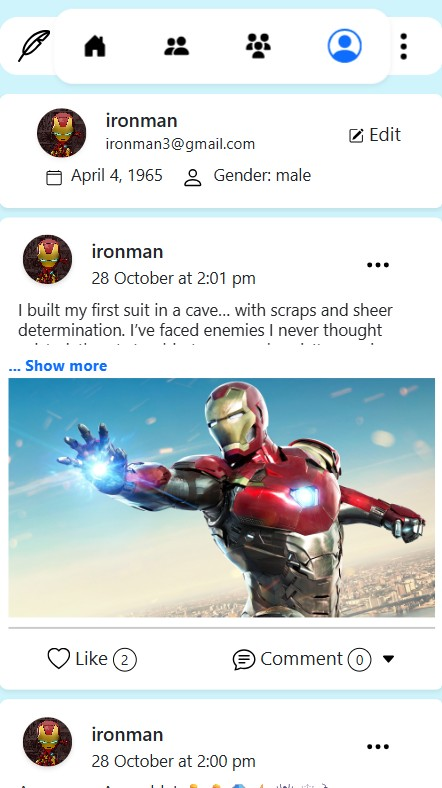
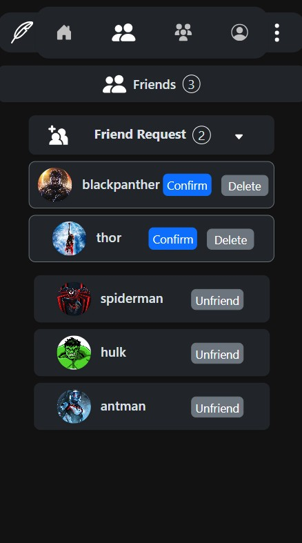
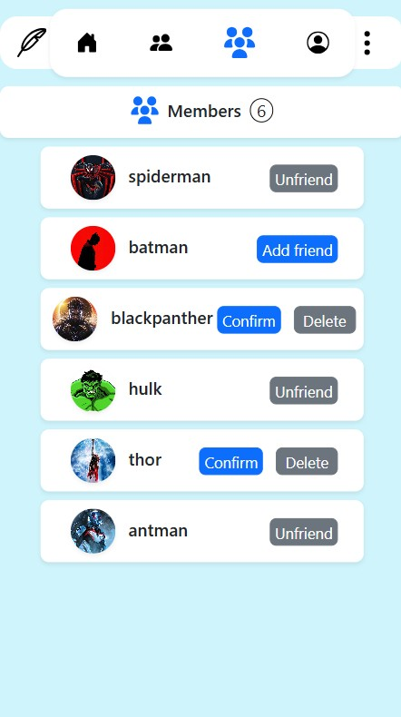

# Koku – Social Media App

Koku is a full-stack social media application that allows users to share posts, connect with friends, like and comment on content, and manage their profiles — all within a clean, responsive interface. Built using Node.js, Express.js, MongoDB Atlas, and AWS S3, featuring a vanilla JavaScript frontend enhanced with minimal Bootstrap styling for a responsive experience.

## 🚀 Demo

### 🔗 Live Demo

You can try Koku – Social Media App live here:  
👉 <a href="https://prawin.dev/project/koku-socialmedia-app" target="_blank" rel="noopener noreferrer">
https://prawin.dev/project/koku-socialmedia-app</a>

### 🖼️ Screenshots / Preview

  <!-- Smaller mobile views below -->
<table>
  <tr>
    <td style="padding:4px;"></td>
    <td style="padding:4px;"></td>
    <td style="padding:4px;"></td>
  </tr>
</table>
<table>
  <tr>
    <td style="padding:4px;"></td>
    <td style="padding:4px;"></td>
    <td style="padding:4px;"></td>
  </tr>
</table>
 <!-- Full-width desktop view -->
  <p>
    
  </p>
</div>

## 🚀 Features

- 🔐 **Authentication & Session Management**
  - Custom **Signup**, **Login**, and **Logout** functionality
  - Supports **multiple simultaneous logins** across devices
  - **Forgot Password** with **OTP verification** via email
  - 🔐 **Logout Options**
  - Logout from the **current device only**
  - Logout from **all active sessions** across devices with a single click

- 🖼️ **Post Management**
  - Upload **images with captions** (stored securely on **AWS S3**)
  - ✏️ **Edit** or **Delete** your own posts

- 💬 **Like & Comment System**
  - **Like** and **Comment** on posts

- 🗑️ **Comment Management**
  - **Delete** your own comments

- 🧑‍🤝‍🧑 **Friend System**
  - **Send**, **Accept**, **Reject**, or **Cancel** friend requests
  - **Unfriend** existing friends

- 🧑 **User Profiles**
  - View and update user details (**username**, **email**, **age**)
  - Upload a **profile picture** (stored on **AWS S3**)
  - If no picture is uploaded, display **user initials** with a **gradient background**

- 🌙 **Dark/Light Mode Toggle**
  - Seamlessly switch between **Dark** and **Light** themes

- 💾 **MongoDB Atlas**
  - Cloud-hosted **NoSQL database** for storing user, post, and comment data

- ✉️ **Nodemailer Integration**
  - Sends **OTP emails** securely for password recovery

- ☁️ **AWS S3 Storage**
  - Reliable and secure **cloud storage** for all uploaded images

## 🛠️ Tech Stack

### Frontend

- HTML, CSS, JavaScript
- Bootstrap (minimally used for responsive UI).
- js-cookie (for handling cookies on client side)

### Backend

- Node.js (JavaScript runtime)
- Express.js (web framework)
- bcrypt (password hashing)
- jsonwebtoken (JWT authentication)
- cookie-parser (parsing cookies)
- cors (enabling CORS)
- dotenv (environment variable management)
- express-validator (input validation)
- multer (file upload handling)

### Database

- MongoDB Atlas (cloud-hosted NoSQL database)
- Mongoose (MongoDB ODM for schema and querying)

### Cloud & Storage

- AWS S3 SDK (`@aws-sdk/client-s3`, `@aws-sdk/s3-request-presigner`) for secure media upload/storage

### Email Service

- Nodemailer (sending OTP and email notifications)

## 🚀 Getting Started

Follow these steps to run the project locally.

### 📦 Prerequisites

- Node.js installed
- MongoDB installed (or access to MongoDB Atlas)
- AWS account with an S3 bucket created
- Git installed

### 🔧 Installation

**1. Clone the repository**

```bash
git clone https://github.com/Prawin-736/koku-social-media-app-.git
cd koku-social-media-app-
```

**2. Install backend dependencies**

```bash
cd server
npm install
```

**3. Install cross-env**

The scripts use cross-env to set environment variables in a way that works on all operating systems.

```bash
npm install cross-env --save-dev
```

**4. Set up environment variables**

Create environment-specific `.env` files inside the `server/` directory to separate development and production configurations.

Create two files:

- `.env.development` — for development mode
- `.env.production` — for production mode

Each file should contain the following variables with values specific to your environment:

```env
# MongoDB
DB_URL=mongodb+srv://<username>:<password>@cluster.mongodb.net/<your_db_name>
DB_NAME=<your_database_name>

# JWT
JWT_SECRETKEY=<your_jwt_secret_key>
JWT_OTP_SECRETKEY=<your_jwt_otp_secret_key>
JWT_NEW_PASS_SECRETKEY=<your_jwt_new_pass_secret_key>

# AWS
AWS_BUCKET_NAME=<your_aws_bucket_name>
AWS_REGION=ap-south-1
AWS_ACCESS_KEY=<your_aws_access_key>
AWS_SECRET_ACCESS_KEY=<your_aws_secret_access_key>

# Nodemailer
NODEMAILER_EMAILID=<youremail@example.com>
NODEMAILER_PASS=<your_nodemailer_password>
```

**5. Update package.json scripts**

Open `server/package.json` and add the following to the `scripts` section:

```json
"scripts": {
  "dev": "cross-env NODE_ENV=development node server/server.js",
  "start": "cross-env NODE_ENV=production node server/server.js"
}
```

**6. Start the backend server**

Development mode:

```bash
npm run dev
```

Production mode:

```bash
npm start
```

## 📂 Project Structure

```
Koku App-project
├── client                      # Frontend application
│   └── src
│       ├── assets              # Static assets like icons
│       │   └── icon
│       ├── main                # Main page HTML, CSS, JS
│       │   ├── *.dev.html      # Development HTML files
│       │   └── *.prod.html     # Production HTML files
│       └── user                # User section HTML, CSS, JS
│           ├── *.dev.html      # Development HTML files
│           └── *.prod.html     # Production HTML files
└── server                      # Backend of the application
    ├── aws                     # AWS-related utilities
    ├── src
    │   ├── features            # Core business logic
    │   │   ├── comment         # Comment handling - includes controller, repository, router, and schema
    │   │   ├── main            # Main routes
    │   │   ├── post            # Post handling - includes controller, repository, router, and schema
    │   │   └── user            # User management - includes controller, repository, router, and schema
    │   └── middleware          # user validation, check expired user, error handling
    └── server.js               # Root server file
```

## 🧩 Frontend HTML Files

- Each page has separate files for development and production:
  - \*.dev.html → For **local development**
  - \*.prod.html → For **production deployment**

- Update `<base href="">` and API endpoints in production files before deploying.

## 🌍 Deployment

- **Platform:** AWS EC2
- **Backend:** Running on Node.js with PM2
- **Frontend:** Served with Nginx
- **Live Demo:** [https://prawin.dev/project/koku-socialmedia-app](https://prawin.dev/project/koku-socialmedia-app)

## License

This project is licensed under the MIT License. See the [LICENSE](./LICENSE) file for details.

## 👤 Author

**PRAWIN KUMAR S**

- GitHub: [@Prawin-736](https://github.com/Prawin-736)
- LinkedIn: [Prawin Kumar S](https://www.linkedin.com/in/prawin-kumar-s/)
